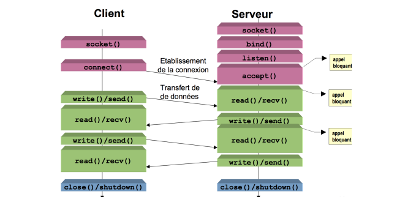

# Network Programming with C :  Windows Sockets API

## Description
### Simple Windows based CLI client-server chat room application written in C and using Windows Sockets API

## Compile and Run

> On which platforme show i run this project ?

This project can only run on **Windows OS** machines, and that's because **Web Sockets** are a down level utilities,  used to establish communication between to nodes.

> Environment setup :

Now before compiling your project you should set up your environment : 

* Install [gcc](https://gcc.gnu.org/) compiler
* Install [make](https://www.gnu.org/software/make/) utility

>### How to compile and build the project ?


1. Compile __server__ files

```bash
make server.o
make server
```

2. Compile __client__ file

```bash
make client.o
make client
```

>### How to run the project ?

1. Run the __server__ program first by executing the following command :

```bash
cd build
serve [ <host> ] [ <port> ]
```

2. will the server is know listening on the socket, we should run the __client__ program :


```bash
cd  build
netchat [ <host> ] [ <port> ] 
```

:clap: :clap: Great job !!

---

## Web Sockets

> Client-Server Lifecycle :




